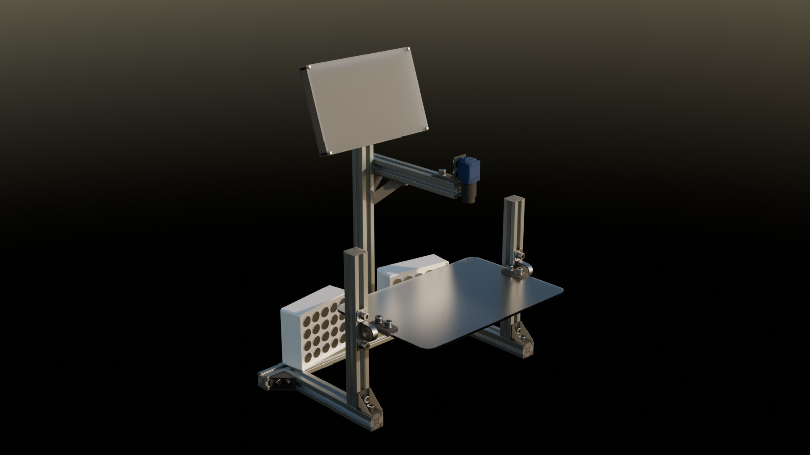
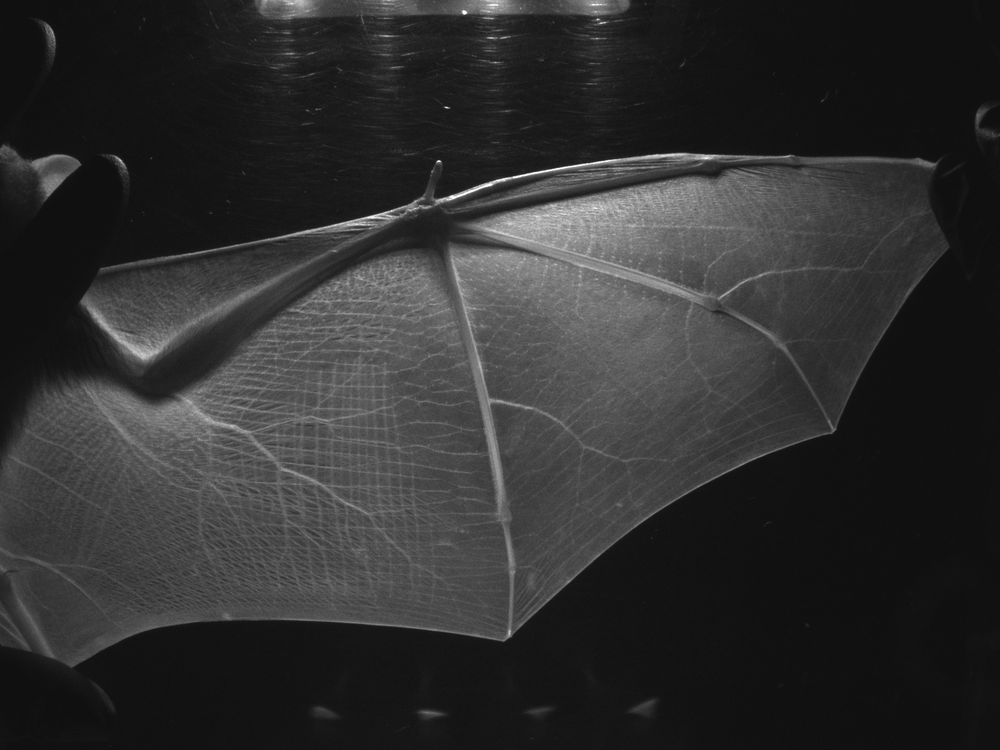

# Bat wing scanner for WingPrint images
This repository contains the code and assembly instructions for the bat wing scanner as described in our WingPrint publication.

Project Website: [https://wingprint.github.io/](https://wingprint.github.io/)





## Software Installation
This guide describes how to set up the bat wing scanner software on different platforms.

### Platforms
The bat scanner software runs on Linux, Windows (and potentially Mac OS if camera drivers are available). Pi mode can be can be enabled by setting `pi: True` in the configuration file `config.yaml`. This will e.g. enable GPIO features.

We have tested the software on Raspberry Pi 3B+, 4B, and 5 models.

### Cameras
The software works with both industrial cameras and other off-the-shelf cameras like webcams.

If an industrial camera that supports the *GenICam* standard is detected, then that one is used. Otherwise the software tries to pick the next best available camera (e.g. a webcam).

If no camera is detected at all, the software will still run, but show unexpected behaviour in some areas.

### Installation on a Raspberry Pi 3/4/5
Download an image of a recent Raspberry Pi OS 64-bit including the Raspberry Pi Desktop. The following setup has been tested with the Raspberry Pi OS version based on Debian Trixie.

**Optional: Camera driver**

If you want to use an industrial camera that supports the *GenICam* standard, then install a *GenTL producer* from the camera manufacturer. Usually, the manufacturers provide either a complete SDK or a stand-alone GenTL producer.

In our case, we installed a stand-alone GenTL producer from *The Imaging Source* in the form of a Debian package:

`sudo apt install ./gen_tl_producer_arm64.deb`

Afterwards, edit the path to the CTI (Common Transport Interface) file of the driver in the `config.yaml` file. In our case the file is located at:

`cti_path: "/usr/lib/aarch64-linux-gnu/gentl/tis/libic4-gentl-u3v.cti"`

**Note:** The file needs to stay in its original location. Don't copy it somewhere else.

If you don't use an industrial camera, then you shouldn't need to install a camera driver.

**Setting up software framework**

First of all, you need to install some system-wide extensions for PyQT5:

`sudo apt install python3-pyqt5.qtmultimedia python3-pyqt5.qtsvg`

Now, create a Python virtual environment, but with system package access:

`python -m venv --system-site-packages .venv`

and activate it:

`source .venv/bin/activate`

Finally, you can install all necessary dependencies in your virtual environment:

`pip install -r requirements.txt`

**Provide a configuration**

Your `config.yaml` file should look similar to this at this point:

```
machine:
  name: 'Batscanner'
  pi: True
  port: 5000
  cti_path: "/usr/lib/aarch64-linux-gnu/gentl/tis/libic4-gentl-u3v.cti"
camera:
  preview_frame_rate: 30
```

**Launching the bat scanner software**

Run the program with:

`python main.py --production`

The *--production* switch enables fullscreen mode. Run the program without it if you are not on a Raspberry Pi or want to debug the program. In this case, the program will roughly scale to its intended target screen size.

You can access the webserver on the scanner under the address https://127.0.0.1:5000 or via the external IP address of your Raspberry Pi if it is part of a network.

The scan database and all images that you take will be stored inside the `<code_folder>/static/capture/<machine_name>` folder.